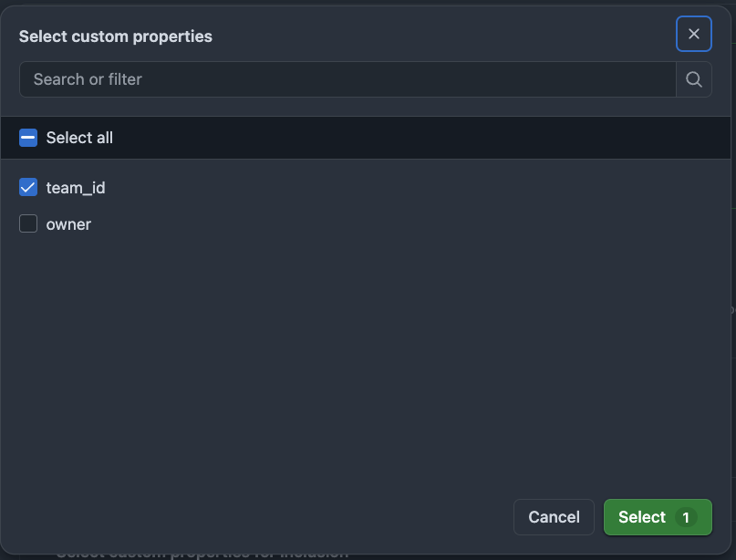
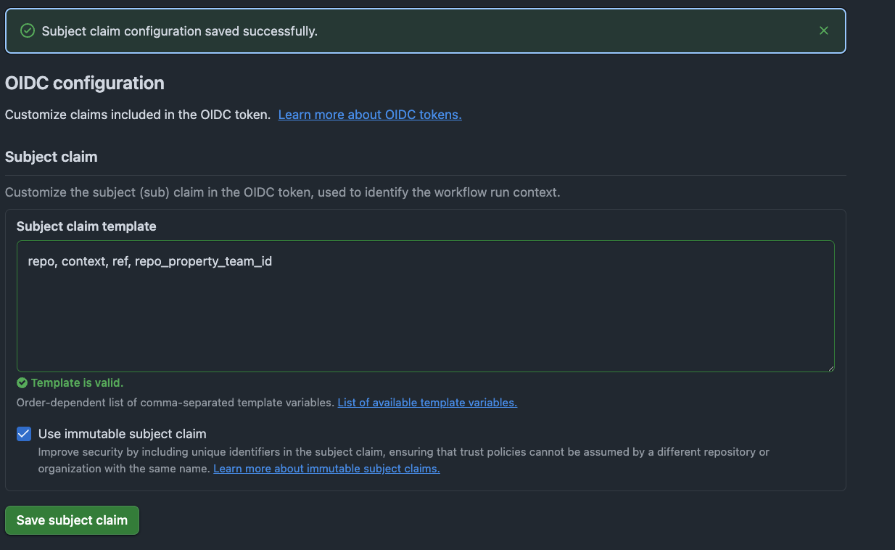
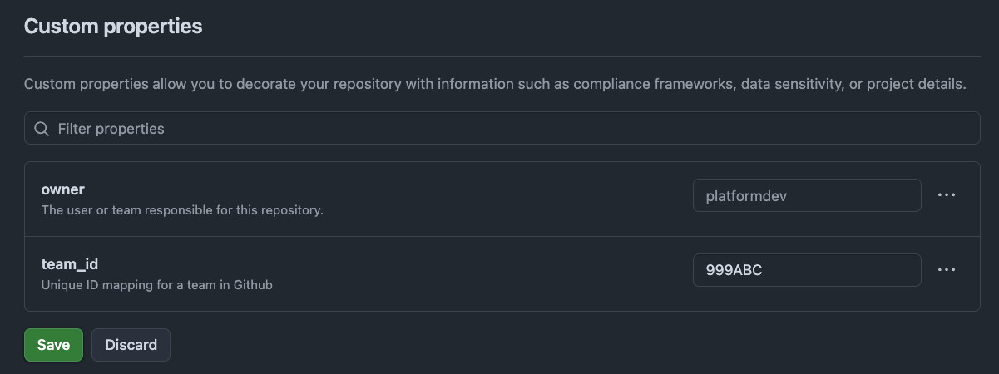

# AWS OIDC Trust Policy with a Custom GitHub Repository Property

This repository contains Terraform configuration that demonstrates how to configure an AWS IAM role for GitHub Actions using GitHub's OIDC provider and a custom repository property.

The example uses placeholder values and is intended for documentation purposes. It does not create the GitHub OIDC provider or the example S3 bucket.

Some assumptions:

- Github IDP is configured in AWS
- Github Organization access as an owner or admin
- Familiarity with Terraform

### Step 1 - Repository Custom Settings at Github Organization

Under Settings -> Repository -> Custom Properties, create your custom property
I'm using `team_id`, which will be available as a key for every repository. 

### Step 2. OIDC settings at Github Organization
Under Settings -> Actions -> OIDC under custom repository settings, select property to be included:



Next, under Subject claim template, ensure repo, context, ref, and repo_property_team_id are included and save. 



This will customize the subject claim ("sub") field in the AWS IAM trust policy to include your custom property. AWS will recognize
only a handful of claim variables, but anything custom under repo_property* is not included. Which is why customizing the subject is critical. 

### Step 3. Add value for team_id under repository custom settings


### Step 4. AWS IAM Trust Policy

The trust policy will look something like this:
```json
{
    "Version": "2012-10-17",
    "Statement": [
        {
            "Effect": "Allow",
            "Principal": {
                "Federated": "arn:aws:iam::999999999:oidc-provider/token.actions.githubusercontent.com"
            },
            "Action": "sts:AssumeRoleWithWebIdentity",
            "Condition": {
                "StringEquals": {
                    "token.actions.githubusercontent.com:aud": "sts.amazonaws.com"
                },
                "StringLike": {
                    "token.actions.githubusercontent.com:sub": "repo:githuborg@1111111111/*:repo_property_team_id:some_value"
                }
            }
        }
    ]
}


```

### Step 5. Add AWS Credentials to your workflow

```yaml
      - name: Configure AWS credentials
        uses: aws-actions/configure-aws-credentials@v6
        with:
          role-to-assume: ${{ env.AWS_GITHUB_OIDC_ROLE_ARN }}
          aws-region: ${{ env.AWS_REGION }}
          audience: sts.amazonaws.com
```
